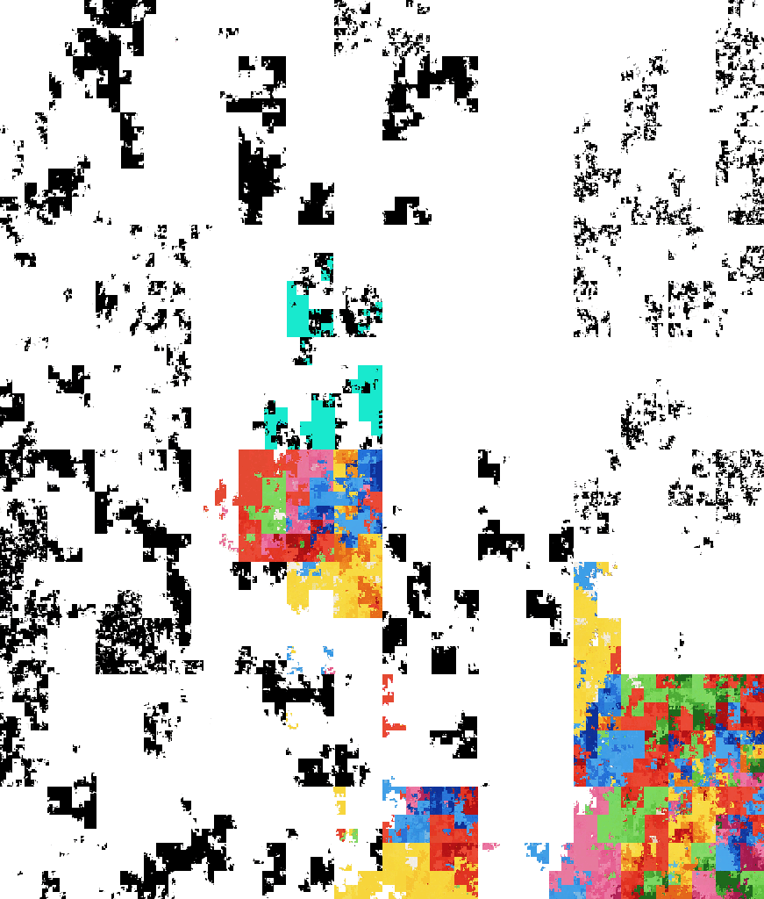
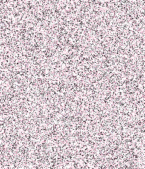
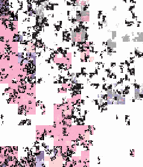
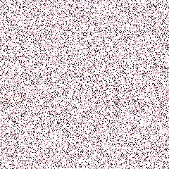
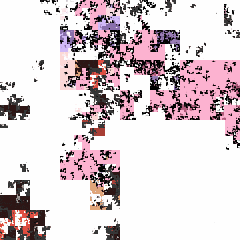

# KaleidoPixel

**[KaleidoPixel 万变像素](https://github.com/fzxx/KaleidoPixel)** 是一款免费的图片混淆工具，采用多种算法实现图片的混淆，**无惧传输中的压缩，社交分享图片神器**。

## 特点

- **多格式支持**：支持 JPEG、PNG、GIF、BMP、WEBP 格式
- **批量处理**：支持同时处理多张图片，提高工作效率
- **双重模式**：提供带界面的桌面应用和无界面的服务器模式（未来）
- **密码保护**：可设置密码，增强安全性

- **实时预览**：加密/解密效果实时可见

- **强壮性**：无惧传输压缩、图床压缩

## 预览

| 原图 | AES | Gilbert |
| :--: | :----: | :----: |
|     |          |          |
|     |          |          |
|     |          |          |

### 在线使用

[地址①](https://kaleidopixel.515188.xyz )   [地址②](https://kaleidopixel.js.org)   [地址③](https://kaleidopixel.netlify.app)

### 离线使用

[下载后运行 KaleidoPixel.exe](https://github.com/fzxx/KaleidoPixel/releases)

## 常见问题

**在聊天软件、图床、社交媒体使用会导致无法还原图片吗？**

- 不会，混淆抗图片压缩。

**兼容互联网上的其它混淆图？加密强度如何？**

- 兼容其它图片混淆（选择Gilbert算法并且使用空密码）
- 由于不验证密码是否正确，**在密码足够强的情况下**，理论上每破解一张图至少需要生成20亿张（Gilbert）/ 2¹²⁸ 张（AES）图并识别是否有意义的内容才能破解；所以**推荐使用AES算法**。

**处理大图片时会卡顿吗？**

- KaleidoPixel 客户端采用多线程处理，能够高效处理大图片；对于特别大的图片，可能需要稍长的处理时间。

**支持处理动画 GIF 吗？部分动画混淆后变色了怎么办？**

- WEB不支持，**客户端支持**处理动画 GIF，会对每一帧进行处理，并保持动画效果。
- 不支持带透明色的GIF，请先用其它工具转换为非透明GIF后再混淆。

## 更新日志

[更新日志](CHANGELOG.md)

## 相关项目

[想曰 - 文本加密让你想曰就曰](https://github.com/fzxx/XiangYue)

[文图变 - 文件藏到图片](https://github.com/fzxx/FileImgSwap)

[坏坏包 - 让压缩包像坏了](https://github.com/fzxx/NaughtyDamagePack)

## 下载地址

[https://github.com/fzxx/KaleidoPixel/releases](https://github.com/fzxx/KaleidoPixel/releases)